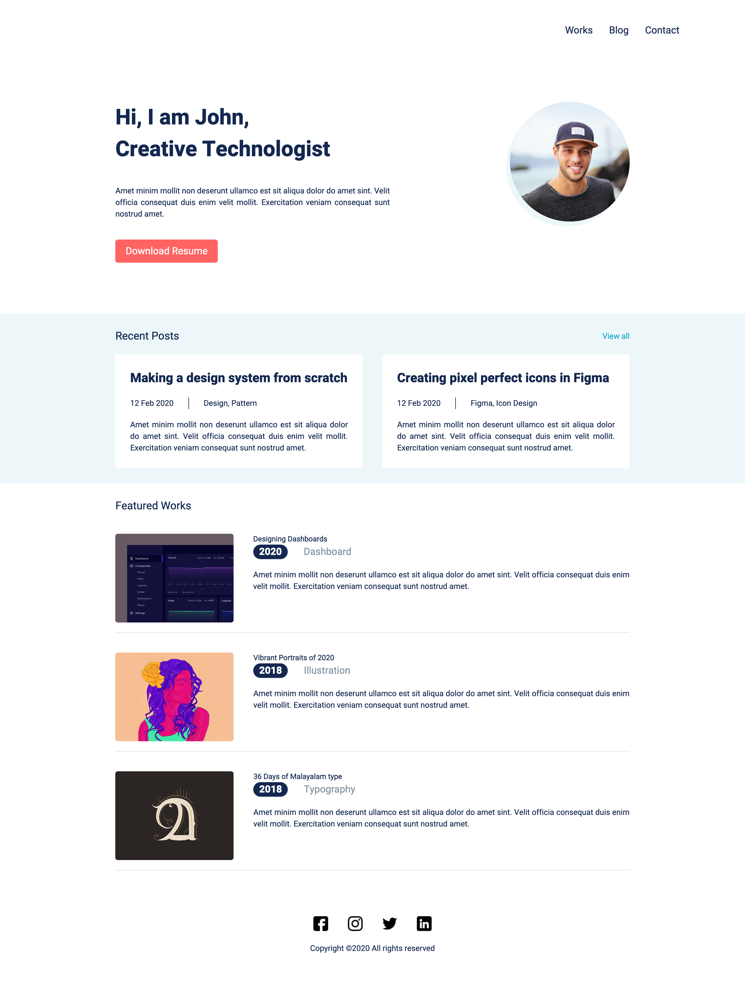
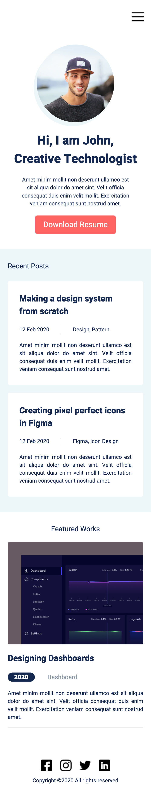

# practice-portfolio-template
Responsive HTML/CSS code of a portfolio Design from figma 

### Links

- Solution URL: [Solution URL here](https://github.com/DorsaBeigifard/practice-portfolio-template)
- Live Site URL: [Live site URL here](https://dorsabeigifard.github.io/practice-portfolio-template/)
- Figma Source URL: [Figma Source URL here](https://www.figma.com/design/gKZoWoleFgP35xvYu83Y2l/Portfolio-UI---Web-%26-Mobile?node-id=0-1&t=2eJod0sjzCcxU1m0-0)

### Screenshot

